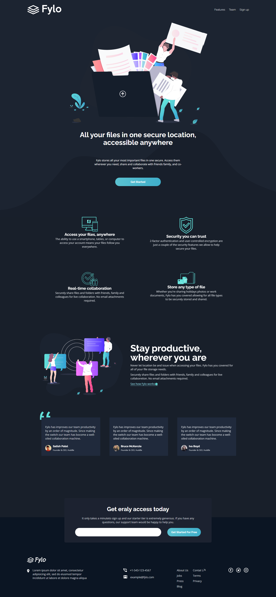
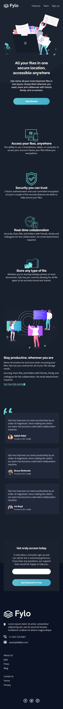

# Frontend Mentor - Fylo dark theme landing page solution

This is a solution to the [Fylo dark theme landing page challenge on Frontend Mentor](https://www.frontendmentor.io/challenges/fylo-dark-theme-landing-page-5ca5f2d21e82137ec91a50fd). Frontend Mentor challenges help you improve your coding skills by building realistic projects.  

## Table of contents

- [Overview](#overview)
  - [The challenge](#the-challenge)
  - [Screenshot](#screenshot)
  - [Links](#links)
- [My process](#my-process)
  - [Built with](#built-with)
- [Author](#author)

## Overview

### The challenge

Users should be able to:

- View the optimal layout for the site depending on their device's screen size
- See hover states for all interactive elements on the page

### Screenshot

### Links

- Solution URL: [https://github.com/wait4ndbleed/fylo-dark-theme-landing-page](https://github.com/wait4ndbleed/fylo-dark-theme-landing-page)
- Live Site URL: [https://fylo-dark-theme-landing-page-liart-one.vercel.app](https://fylo-dark-theme-landing-page-liart-one.vercel.app)

## My process

### Built with

- Semantic HTML5 markup
- Flexbox
- CSS Grid
- Mobile-first workflow
- [React](https://reactjs.org/) - JS library
- [Next.js](https://nextjs.org/) - React framework
- [Tailwindcss](https://tailwindcss.com/) - For CSS
- [React Hook Form](https://react-hook-form.com/) - Form Validation library

## Author

- Website - [Clayton Ferreira](https://github.com/wait4ndbleed)
- Frontend Mentor - [@wait4ndbleed](https://www.frontendmentor.io/profile/wait4ndbleed) 
